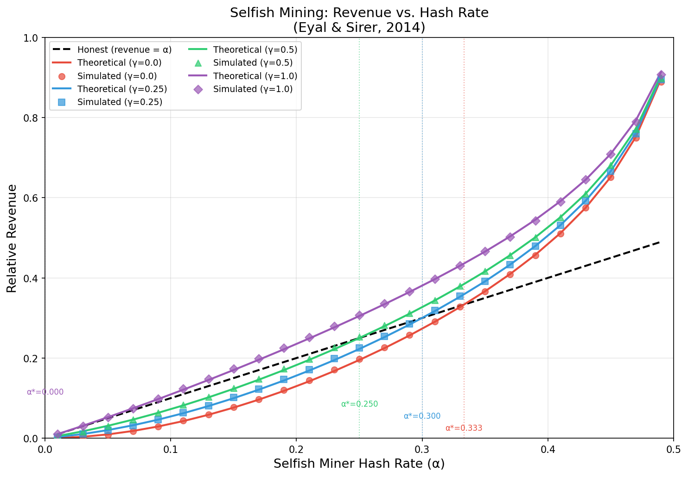
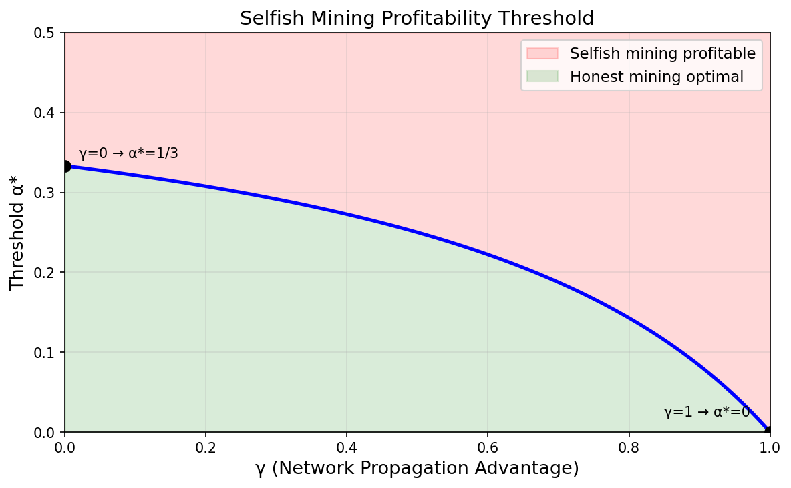
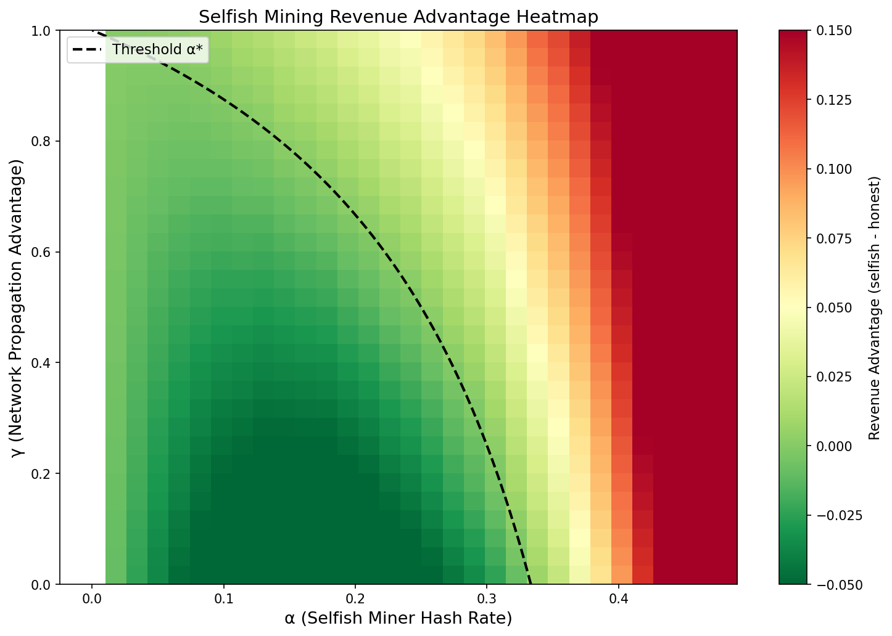
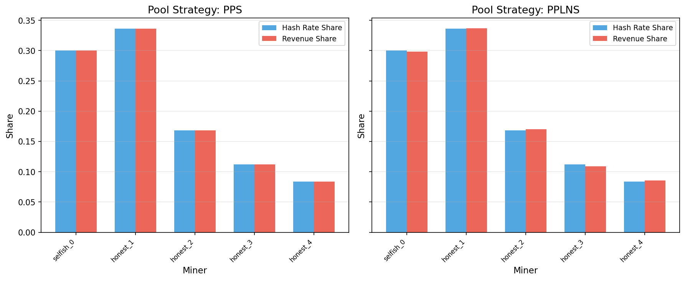
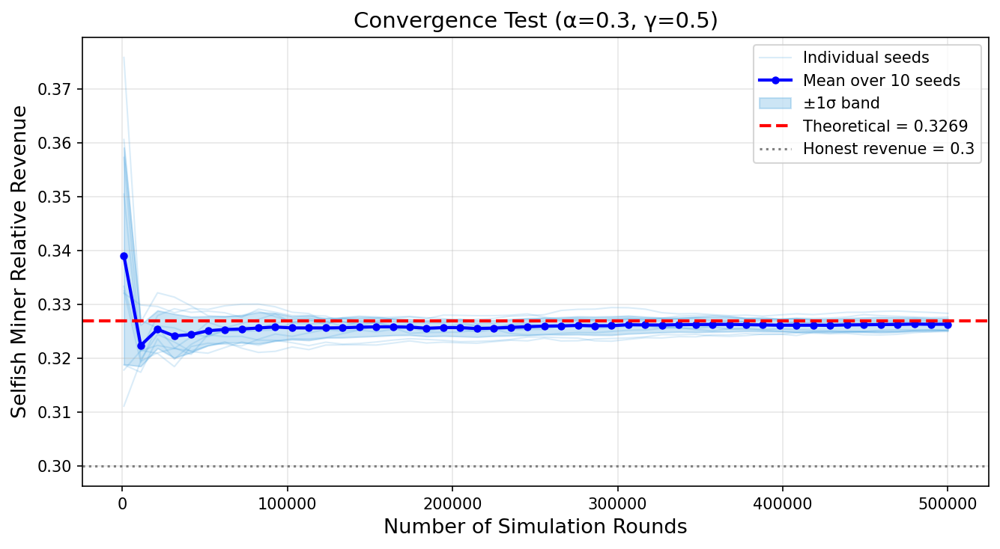
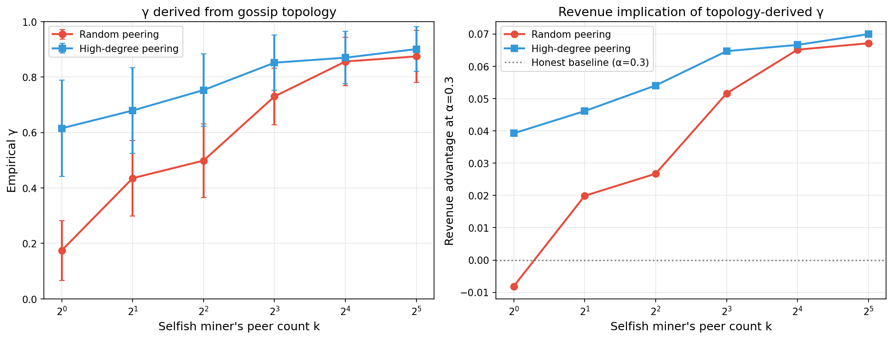

# Reproducing Selfish Mining: A Monte Carlo Study of Bitcoin's Incentive (In)Compatibility

**CS521 — Topic 6B Final Report**

---

## Abstract

In 2014, Eyal and Sirer showed that Bitcoin's protocol fails to be incentive-compatible: a strategic miner can earn more than their share of block rewards by selectively withholding blocks. I build a Monte Carlo simulator that implements the selfish-mining state machine, validate it against the closed-form revenue formula across the (α, γ) parameter space, and extend the study in two directions — multi-miner pools with PPS and PPLNS rewards, and a topology-derived γ that replaces the paper's free parameter with one computed from a gossip network. Across 100,000-round runs the simulator matches the closed-form prediction to within 1–3%, locates the analytical threshold α\* = (1 − γ) / (3 − 2γ), and shows that under high-degree peering a 30%-hash-rate miner can cross the profitability threshold with as few as one well-placed peering connection.

---

## 1. Introduction

Nakamoto-style proof-of-work systems rest on a simple incentive claim: an honest miner who publishes every block immediately maximises their expected revenue, so deviations are not worth attempting. Eyal and Sirer's 2014 result is a counter-example: a *selfish* miner who keeps newly mined blocks private and reveals them strategically earns more than their fraction of hash power, for any hash-power share α above a threshold that can be substantially below 0.5. With even modest network propagation advantages — captured by γ ∈ [0, 1], the fraction of honest hash power that adopts the selfish chain in a tie — the threshold falls to 25% and below.

This report has three goals: **reproduce** the central revenue-vs-α curves of Eyal & Sirer (2014) with a Python Monte Carlo simulator; **validate** against the closed-form formula over the (α, γ) plane and a long-run convergence test; and **extend** to multi-miner pools (PPS vs PPLNS) and to a topology-derived γ. Section 2 reviews the model. Section 3 gives the state machine and the closed-form result. Section 4 documents the implementation. Section 5 presents six experiments. Sections 6–7 discuss limitations and conclude.

---

## 2. Background

### 2.1 The Bitcoin protocol and proof-of-work

Bitcoin organises transactions into blocks, each cryptographically linked to its predecessor. Miners compete to extend the longest chain by solving a hash puzzle; difficulty is recalibrated every 2016 blocks to keep block time near ten minutes. The miner of an accepted block collects a fixed block reward. When two miners find a block at nearly the same height, a temporary fork results; the network resolves it by extending whichever branch grows next. In an idealised model with instantaneous propagation, a miner controlling fraction α of hash power finds fraction α of blocks — honest mining is "fair" in the proportional sense.

### 2.2 The selfish mining attack

The selfish miner maintains a *private* branch of the chain. When they find a block they keep it secret and continue mining a lead. The honest network, unaware, continues on the older public branch. The attacker uses the hidden lead strategically: if honest catches up to within one block, the selfish miner publishes and a fork race ensues — the parameter γ ∈ [0, 1] captures the fraction of honest hash power that, in expectation, adopts the selfish branch in such a tie; if honest falls two or more blocks behind, the selfish miner publishes the entire private chain and overrides the honest work; if the lead grows large, every honest block is matched by publishing one private block to preserve the lead. The effect is that honest work ends up wasted on the discarded branch, and the selfish miner's share of the canonical chain exceeds α. A miner with γ = 1 (perfect connectivity) wins every tie; a miner with γ = 0 always loses ties.

---

## 3. Model and Analytical Result

### 3.1 State machine

The system state is a non-negative integer **lead** plus a Boolean flag indicating whether a **fork race** is currently active (the state called *0′* in the original paper, where both chains have equal length). Transitions in each round depend on which miner finds the next block (probability α / 1 − α) and the current state:

| State          | Selfish finds block       | Honest finds block                                                  |
| -------------- | ------------------------- | ------------------------------------------------------------------- |
| lead = 0       | lead ← 1 (withhold)       | honest +1                                                           |
| lead = 1       | lead ← 2                  | publish private chain, enter fork race                              |
| fork race (0′) | selfish +2, fork resolved | with prob γ: selfish +1 and honest +1; otherwise: honest +2         |
| lead = 2       | lead ← 3                  | publish whole private chain, selfish +2, lead ← 0                   |
| lead ≥ 3       | lead ← lead + 1           | match: publish one private block, selfish +1, lead ← lead − 1       |

### 3.2 Closed-form revenue

Eyal and Sirer derive the selfish miner's long-run relative revenue by computing the stationary distribution of this Markov chain:

R(α, γ) = [ α · (1 − α)² · (4α + γ · (1 − 2α)) − α³ ] / [ 1 − α · (1 + α · (2 − α)) ]

with **profitability threshold** α\*(γ) = (1 − γ) / (3 − 2γ). Three reference points anchor the picture: α\*(0) = 1/3, α\*(1/2) = 1/4, α\*(1) = 0. The formula assumes (i) an infinitely long run, (ii) a single selfish miner versus an aggregated honest majority, and (iii) γ constant and exogenous. The simulator quantifies convergence in finite samples, tests whether realistic hash-power distributions change the picture, and — by deriving γ from a gossip topology — relaxes (iii).

---

## 4. Implementation

Pure Python with NumPy and Matplotlib. Five files:

| File                | Role                                                                                |
| ------------------- | ----------------------------------------------------------------------------------- |
| `simulator.py`      | `SelfishMiningSimulator` class, theoretical formula, threshold function             |
| `strategies.py`     | `MiningPool` with PPS / PPLNS, Zipf and uniform hash-rate distributions             |
| `topology.py`       | Scale-free gossip network, propagation model, empirical γ from a peering policy     |
| `visualization.py`  | Plotting routines for the six figures                                               |
| `main.py`           | CLI entry point, experiment definitions, demo mode                                  |

`SelfishMiningSimulator.run(num_rounds)` is the inner loop: each round draws a Bernoulli trial with probability α to decide which side finds the next block, then dispatches to handlers that implement the transition table above. State is kept in two integers and a Boolean rather than a full block tree — sufficient because only the relative lengths of branches affect the next transition. The pool layer in `strategies.py` distributes block rewards proportionally to declared hash rate (PPS) or over a rolling N = 200 share window (PPLNS). All experiments seed the RNG with 42 and are deterministic given the seed; rerunning `python main.py` produces bit-identical figures.

---

## 5. Experiments

Six experiments. The first four reproduce the central revenue and threshold results and extend them to a multi-miner pool; the fifth quantifies convergence; the sixth derives γ from a gossip topology.

### 5.1 Revenue Curves



α ∈ [0.01, 0.49] at 25 points × γ ∈ {0.0, 0.25, 0.5, 1.0}, 100,000 rounds each. The dashed diagonal is the honest baseline R = α; solid curves are theory, scatter points are simulation. Three observations: (i) the simulator tracks theory across the entire range, typical deviation < 0.01, max ≈ 0.03; (ii) each γ-curve crosses the diagonal exactly at α\*(γ) = (1 − γ) / (3 − 2γ); (iii) post-threshold growth is steep — at α = 0.45 and γ = 0.5 the selfish miner takes 65% of blocks versus the honest baseline 45%, a 44% lift.

### 5.2 Profitability Threshold vs γ



α\*(γ) over γ ∈ [0, 1]; the green region (honest optimal) and red region (selfish profitable) are shaded. The threshold decreases monotonically and the rate accelerates as γ → 1: from 33.3% at γ = 0 to 25% at γ = 0.5, 16.7% at γ = 0.75, and 0% at γ = 1. The operational point: **network-layer hardening of the gossip protocol is a security feature on par with hash-rate decentralisation**. A miner with privileged peering relationships can break even at a far smaller share than 33%, and this is invisible in the often-quoted "51% attack" framing.

### 5.3 Revenue Advantage Heatmap



A 30 × 30 grid over (α, γ), 50,000 rounds per cell, with the simulated advantage R(α, γ) − α shown as colour and the analytical threshold α\*(γ) overlaid as a dashed curve. The green/red boundary follows the dashed line to within one or two grid cells across the entire plane — a stronger validation than the curves alone, because it tests the threshold prediction at every γ simultaneously rather than at four discrete values. The advantage grows fastest in the upper-right corner: near α = 0.45 and γ = 1 the simulated advantage reaches +0.20 — the selfish miner takes 65% of blocks while controlling 45% of hash power.

### 5.4 Pool Strategies (PPS vs PPLNS)



A five-miner pool with Zipf-distributed hash rates (30% selfish, the remaining 70% split 1 : 1/2 : 1/3 : 1/4 among honest miners), 20,000 rounds. Under PPS, revenue shares match hash-rate shares to within 1% — PPS is proportional by construction. Under PPLNS (window N = 200), revenue shares wobble around hash rates by a few percent; this is the natural finite-sample variance of the PPLNS window, not the selfish-mining attack of §5.1–5.3 reappearing in pool form. The takeaway: pool-level reward design and protocol-level incentive compatibility are *separate* security layers — both reward schemes distribute fairly in the long run, but neither prevents a pool *as a whole* from running selfish mining against the rest of the network.

### 5.5 Convergence



α = 0.3, γ = 0.5 fixed; theoretical revenue 0.3269. The simulator is run at 50 checkpoints between 1,000 and 500,000 rounds, with each checkpoint averaged over **ten independent seeds**; the figure shows the individual seed traces (light blue), the cross-seed mean (dark blue), and the ±1σ envelope (shaded). Averaging across seeds matters: a single-seed convergence plot only traces one realisation of a random walk and can sit on either side of the theoretical value for arbitrarily long stretches, which would not be evidence of convergence at all. **This is the single most operationally important finding of the simulator.** At 1,000 rounds the ten seeds span 0.31–0.37 — individual short runs can deviate from theory by several percentage points, large enough to flip the sign of the advantage. By 10,000 rounds the band tightens to roughly ±0.005, by 100,000 rounds the mean tracks the theoretical line to within 0.001, and by 500,000 rounds the cross-seed mean and the closed-form prediction are visually indistinguishable. The ±1σ envelope contracts at the expected √N rate. The practical lesson: any empirical claim about selfish-mining revenue based on a single short Monte Carlo run should be treated with suspicion — convergence to the closed-form value is reached, but the per-seed variance at small N is large enough to make a single run misleading.

### 5.6 Topology-derived γ



The first five experiments treat γ as a free parameter. In a real deployment γ is not chosen — it is the *output* of a gossip topology and a peer-selection policy. This is the sharp asymmetry that operationally matters: α is *purchasable* (a miner can simply buy more ASICs), whereas γ is *topological* and far harder for an outsider to audit. This experiment closes the loop by deriving γ empirically and feeding it back into the analytical formula.

**Setup.** Fifty honest miners on a Barabási–Albert scale-free graph (m = 3), Zipf-distributed hash rates randomly assigned across nodes. Propagation is flooding gossip with a 100 ms per-edge delay; the selfish miner publishes through *k* direct peers (50 ms relay-to-peer delay), simultaneously with an honest miner — sampled in proportion to hash rate — publishing the competing block. For each fork race every honest node computes which block arrives first; γ is the expected fraction of honest hash rate that adopts the selfish branch, averaged over 200 honest publishers. Two peer-selection strategies are compared: **random peering** and **high-degree peering** (attaching to the k highest-degree hubs).

**Results.** Left panel: γ rises monotonically with k under both strategies but at very different rates — with random peering γ climbs from 0.17 at k = 1 to ~0.87 at k = 32, while high-degree peering already exceeds 0.6 at k = 1 and saturates near 0.90 by k = 8. *Who* the selfish miner peers with matters more than *how many* peers it has — eight well-chosen connections deliver more γ than thirty-two random ones. Right panel: plugging each empirical γ back into the analytical formula at a fixed α = 0.3 turns peer count into a direct revenue advantage. Under high-degree peering the miner is profitable from k = 1 alone; under random peering only at k ≥ 2 and modestly until k ≥ 8. The operational implication: **a well-connected miner at α = 0.3 is more dangerous than a poorly-connected miner at α = 0.4** — and this asymmetry is invisible in the paper's flat γ ∈ [0, 1] parameterisation.

---

## 6. Discussion and Limitations

The simulator matches the analytical predictions to within sampling noise across all parameter regimes. The closed-form formula is therefore both correct and operationally usable: a defender can take it at face value when reasoning about which hash-power thresholds are dangerous at a given level of network connectivity. Two practical conclusions follow. First, the often-quoted "51% attack" framing materially understates the security margin: meaningful incentive violations are possible at 33% with no network advantage and at smaller fractions for well-connected miners. Second, **network hardening matters**. A defender should measure empirical γ (for instance, by tracking which pool wins fork races more often than its hash-rate share would predict) and reduce it adversarially — better-distributed relay infrastructure or a uniform-random tie-breaking rule. §5.6 quantifies the per-peer revenue value, giving a back-of-the-envelope way to reason about relay-graph interventions.

The model has well-known limitations. (1) **Two-player abstraction.** The honest side is modelled as one aggregated entity; Sapirshtein, Sompolinsky & Zohar (2016) show the multi-attacker case is qualitatively different. (2) **γ on a static topology.** §5.6 relaxes the "γ as a free parameter" assumption but the topology is drawn once at the start; a fuller model would let the attacker dynamically rewire its peering as the attack progresses. (3) **No transaction fees.** As Bitcoin transitions toward fee-only rewards, Carlsten et al. (2016) show new strategic deviations (*undercutting*) emerge that this model does not capture. (4) **Discrete-round model.** Continuous-time arrival statistics and propagation delays are not captured. (5) **No defensive mechanisms** (e.g., uniform-tie-breaking) are implemented as protocol variants.

---

## 7. Conclusion

This project reproduces the Eyal–Sirer selfish-mining result with a from-scratch Monte Carlo simulator, validates it across the (α, γ) plane and a long-run convergence test, and extends the model in two directions: a multi-miner pool with PPS/PPLNS rewards, and a topology-derived γ that replaces the paper's free parameter with one computed from a gossip network. The central claim — **Bitcoin is not incentive-compatible** — survives every parameter regime tested, and the strength of the result is calibrated by α\* and γ in ways that any serious proof-of-work security analysis must account for. The topology experiment in particular shows that the practical security of Nakamoto consensus depends not only on hash-rate decentralisation but on peering policy: at α = 0.3, switching from random to high-degree peering with a single connection is enough to cross the profitability threshold.

---

## References

1. Eyal, I., & Sirer, E. G. (2014). *Majority is not Enough: Bitcoin Mining is Vulnerable.* FC 2014, Springer LNCS 8437, pp. 436–454.
2. Nakamoto, S. (2008). *Bitcoin: A Peer-to-Peer Electronic Cash System.* https://bitcoin.org/bitcoin.pdf
3. Sapirshtein, A., Sompolinsky, Y., & Zohar, A. (2016). *Optimal Selfish Mining Strategies in Bitcoin.* FC 2016, Springer LNCS 9603, pp. 515–532.
4. Carlsten, M., Kalodner, H., Weinberg, S. M., & Narayanan, A. (2016). *On the Instability of Bitcoin Without the Block Reward.* CCS '16, pp. 154–167.
5. Heilman, E. (2014). *One Weird Trick to Stop Selfish Miners: Fresh Bitcoins, a Solution for the Honest Miner.* FC Workshops 2014, Springer LNCS 8438, pp. 161–162.

---

## Appendix — Reproducing the Figures

```bash
pip install numpy matplotlib
python main.py              # all 6 experiments + demo
python main.py -e 1..6      # run a single experiment
python main.py --demo       # text-only sanity check
```

Default random seed is 42 throughout; results are deterministic given the seed.
